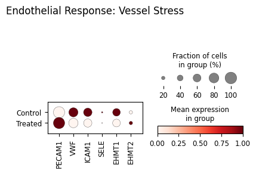
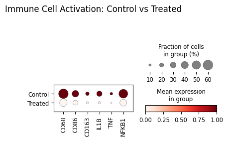
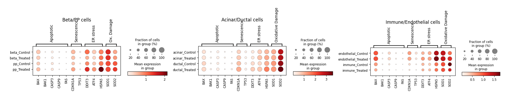

# Case study
**Behaviour of Pancreatic cells exposed to Metabolic stress**

Samples used for this case study come from the following study [1]  

The contents of this study:  
 - This study examined the functional changes of different pancreatic cells under conditions of metabolic stress (overnutrition). 
 - I performed complete scRNA cell raw data processing using different platforms and tools
 - Final functional analysis was performed using scanpy. 

# Keywords
Pancreatic islet cells, Metabolic stress, Response to lipo-glucotoxicity, Endocrine response to overnutrition, Exocrine response to overnutrition, ADM shift, Type II diabetes

# 1. Processing flow

Complete processing flow [*] was divided into four stages and is depicted in the Figure 1:

**Figure 1: Complete Processing flow**

## 1.1 Part I - Preprocessing

Part I included preprocessing of scRNA-seq reads and matrix creation (Galaxy WF).  Following steps were performed in the galaxy environment (usegalaxy.eu):  
  > (1) Mapping (RNAstar solo)  
  > (2) Utility for handling of SC input data (DropletUtils)  
  > (3) AD object creation.  

## 1.2 Part II - Integration of annotation and metadata 

Part II of the processing included preprocessing of reference dataset [2] and its use for annotation of query dataset using scanpy ingest. It was performed on Google colab environment (Jupyter notebook w/python core - code can be made available on request).  Following steps were performed:  
> (1) Load and preprocess the reference dataset  
> (2) Import query dataset from google drive  
> (3) Update gene annotation for query dataset  
> (4) Preprocess query dataset  
> (5) Dimensionality reduction and clustering (query dataset)  
> (6) Remove cells not expected in query dataset from reference dataset  
> (7) Intersect genes between two datasets  
> (8) Map onto a reference dataset using ingest.  

## 1.3 Part III - single cell object Processing pipeline

Part III of the processing included downstream processing pipeline for SC (scanpy standard flow). It was performed on Google colab environment (Jupyter notebook w/python core - code can be made available on request).  Following steps were performed:  
> (1) Load AD object from Galaxy  
> (2) Filter out reads containing genes that are not of interest (Mitochondrial, ribosomal, hemoglobin genes, pseudogenes etc.)  
> (3) Filter cells based on quality  
> (4) Doublet detection  
> (5) Normalization  
> (6) Feature selection  
> (7) Dimensionality reduction  
> (8) Nearest neighbor graph constuction and visualization (UMAP)  
> (9) Clustering with Leiden comunity  
> (10) Quality control and cell filtering - reassessment  
> (11) Cluster annotation  
> (12) Create markers for known Pancreatic cell types  
> (13) Create dotplots to identify markers per cluster  
> (14) Plot top cluster marker genes  
> (15) Differentially expressed genes  
> (16) Automatic cell type annotation (celltypist)  
> (17) Trajectory inference.  

## 1.4 Part IV - Functional analysis

Part IV of the processing included downstream Functional analysis of the obtained (**) results.  Following analysis was performed:  
> (1) Conversion of the source .rds file into h5ad format (sceasy convert - usegalaxy.eu)  
> (2) Inspection, clean up and QC of the final adata object  
> (3) Single cell object processing w/scanpy  
> (4) Predict labels for query dataset  
> (5) HVG feature selection, scaling and dimensionality reduction  
> (6) Nearest neighbor graph construction  
> (7) Batch detection (see Figure 2) and removal (see Figure 3)  
> (8) Functional analysis - see following section.  

# 2. Biological Interpretation of the Results 

Final part of the analysis was interpreting obtained results in the light of metabolic stress conditions to which the cells were exposed. 

## 2.1 Cell identities

After processing steps (see Part IV, steps (1) - (6), plotting clusters of cell families in the data matrix revealed batch effect (see Figure 2).

**Figure 2: UMAP plots (batch, treatment, cell.type.final) - batch effect** 

After batch removal (using Harmony, Part IV, step (7)), the batch effect was not detected any more, see Figure 3.

**Figure 3: UMAP plots - batch effect removed**

**Comment**

Comparing middle plot for Acinar, Ductal and Alpha cells clusters shows complete overlapping of treated and control conditions.   This confirms that these cell types are relatively stable in their overall transcriptomic identity (resilience).
Beta cells cluster on the other hand shows some separation between Control and Treated conditions, which denotes change of transcriptomic identity.

**Figure 4: UMAP plot of cell families**

**Comment**

The UMAP plot of cell families shows also rare epsilon cells, which are closely related to alpha cells.  Separate plot is required to highlight their position in the UMAP plot to reveal the proximity to the alpha cells cluster.

**Figure 5: UMAP plot w/highlighted alpha/epsilon cell clusters**

**Comment**

The UMAP plot reveals that they are indeed near the alpha cluster, but they maintain their transcriptomic identity.  Another important plot is the UMAP plot of Ghrelin they secrete.

**Figure 6: UMAP plot of Ghrelin**

**Comment**

The UMAP plot reveals that secretion of Ghrelin is most intense in the vicinity of epsilon cell cluster.

## 2.2 Metabolic stress

Figure 7 shows response to metabolic stress of cells under test in a dotplot. I used following markers as indicators: 
 - GCG -> most significant product of alpha cells 
 - INS -> most significant product of beta cells  
 - EHMT1, EHMT2 -> Epigenetic modulators driving the remodeling of gene regulatory network under stress  
 - GHRL -> most significant product of epsilon cells. 
 

**Figure 7: Metabolic stress response of pancreatic islets**

This plot provided some detail, but in order to get a more detailed picture, I created separate plots for endocrine and exocrine cell families. 

### 2.2.1 Endocrine cell response to metabolic stress

In order to make more distinction in the endocrine department, I created separate plots for Alpha cells (Figure 8) and Beta cells (Figure 9).

**Figure 8: Alpha cell response**

**Comment**
 
(1) GCG (Glucagon) response 
Treated population -> GCG dot remains remarkably large and dark. This confirms that unlike beta cells, alpha cells do not lose their primary hormonal identity under metabolic stress. 
 
*Possible conclusion* 
Alpha cell response show resilience to metabolic stress 
 
(2) EHMT1/2 Upregulation 
Just like  beta cells,  alpha cells also show a dramatic increase in EHMT1 and EHMT2 expression. This proves that the epigenetic "stress response" is happening across all endocrine cells, but the outcome is different: it disables beta cells while alpha cells stay stable. 

**Figure 9: Beta cell response**

**Comment**
 
(1) INS (Insulin) response 
Control population -> shows a healthy state (almost 100% of beta cells are producing Insulin) 
Treated population -> the average expression of Insulin per cell has dropped.  
 
*Possible Conclusion* 
This shows evidence of beta cell dysfunction. 
 
(2) Epigenetic upregulation (EHMT1 and EHMT2) --> significant increase in treated cell population.  
 
*Possible Conclusion*  
Metabolic stress triggers epigenetic regulators (G9a and GLP), which then act as brakes on functional genes like Insulin. 
 

### 2.2.2 Exocrine cell response to metabolic stress

I have examined response of exocrine cells (acinar - Figure 10, ductal - Figure 11, and delta cells - Figure 12) to metabolic stress.  

**Figure 10: Exocrine cell response - Acinar cells**
 

**Comment** 
(1) Metabolic shock 
Under treatment condition, secretion of digestive proteases PRSS1 and CPB1 increases significantly. 
This could indicate metabolic shock --> the cells are reacting by over-producing, potentially leading to self-digestion. 
 
(2) Epigenetic upregulation 
Production of EHMT1 goes up with the enzymes, which indicates shift in epigenetic activity as a consequence of metabolic shock. 
 
(3) Metaplasia (ADM)  
In a state of metabolic shock, acinar cell are expected to change their identity to ductal, but the dotplot reveals that SOX9 (ductal marker) actually decreases.  

*Possible Conclusion* 
Identity Shift (Metaplasia) theory isn't evident for this specific data. 

**Figure 11: Exocrine cell response - Ductal cells**

**Comment** 
(1) Identity loss 
KRT19 and CFTR (ductal markers) are reduced, which indicates, that Ductal cells appear to be losing functionally and identities.   

 
Epigenetic upregulation 
Similar to Acinar cell, production of EHMT1 goes up with the enzymes, which indicates shift in epigenetic activity as a consequence of metabolic shock.   
 

 

**Figure 12: Exocrine cell response - Delta cells**  

**Comment** 
(1) Epigenetic downregulation 
Since EHMT1 is not regulated in the same way in all affected cells, it can not be directly related to metabolic stress   
 
Somatostatin (SST) 
SST expression increases (becomes darker/larger) in the Treated group, HHEX (the Delta cell master regulator) also increases. In a typical diabetic model, Delta cells are expected to fail. 

*Possible conclussion* 
By ramping up  SST, these cells are likely trying to shut down the Alpha and Beta cells to protect them from the metabolic stress (hyper-secretion exhaustion). 
 

# 3. Response of other cells types

Since the cell matrix contains other cell types as well, it is necessary to inspect how they responded to conditions of metabolic stress. I examined the response of two types of cells 
 - Endothelial cells --> In conditions of overnutritions, vessel stress may be expected 
 - Immune cells --> In a state of glucolipotoxicity (metabolic stress), immune cells release cytokines, that (1) directly force Beta cells to stop making insulin and (2) push Acinar cells toward ductal (ADM) identity. 

## 3.1 Response of Endothelial cells

Under conditions of diabetes and metabolic stress, blood vessels often undergo Endothelial Dysfunction. They stop being smooth conduits and start leaking or expressing adhesion molecules that stress the surrounding cells. 
For Investigation of endothelial cells, I used markers for vessel health, structural integrity, and stress: 
> (1) Structural/Identity (PECAM1 (CD31) and VWF (Von Willebrand Factor)) 
> (2) Stress/Dysfunction (ICAM1 and SELE (Selectin E))  
> (3) The epigenetic markers (EHMT1 and EHMT2). 
 
The response of endothelial cell markers is shown on Figure 13: 

**Figure 13: response of endothelial markers**

**Comment** 
Usually, stress/inflammation marker (ICAM1) is exspected to go up in treated vessels, which is not the case here. 
Identity marker for endothelial cells (PECAM1) looks larger/darker in the Treated group. 
The endothelial cells (1) aren't showing signs of inflammation; (2) they are losing their functional markers (VWF) while (3) retaining their structural identity (PECAM1).  
 
Unlike in Beta cells, where EHMT1 went up significantly in the Treated group, EHMT1 goes down in the Endothelial cells Treated group.
 

**Possible interpretation** 
(1) The epigenetic response (EHMT1)   
Epigenetic response may be specific to cell types (exocrine, endocrine). 

(2) Vessel Resilience 
Blood vessels might be using an entirely different survival strategy, or they might be less susceptive to this specific epigenetic switch.

## 3.2 Response of Immune cells

In the state of metabolic stress, immune cells secrete cytokines that modulate the activity of endocrine as well as exocrine cells.  
I looked are the following type of immune response: 
> (1) Macrophage Activity --> CD68, CD163, and CD86 
> (2) Inflammatory Signals (Cytokines) --> IL1B, TNF, IL6 
> (3) Master regulator of inflammation --> NFKB1. 
 
The response of these markers is plotted on the Figure 14.
 

 **Figure 14: Response of Immune cells**

**Comment** 
Immune Cell Activation signals (CD68, CD86, IL1B, and NFKB1) are significantly higher in the Control than in the Treated group.  
This may suggest that the Treated group has less immune activity than the Control group. 
 
**Possible interpretation** 
This behavior is counter intuitive, since under conditions of metabolic stress model, the pro-inflammatory response is expected to increase.  

**Epigenetic response**  
If EHMT1/2 were triggered by immune signals (cytokines), there should be high cytokine activity in the Treated group. Instead, we see the following behavior:
> (1) Low Immune Signals in Treated cells
> (2) High level of epigenetic response with EHMT1/2 in Treated cells 
> (3) High Stress (ADM/Beta failure) in Treated cells. 
 
This may suggest that the epigenetic regulators (EHMT1/2) could be responding directly to the high levels of glucose and lipids, rather than being instructed by the immune system.  
 

# 4. Programmed Cell Death (Apoptosis) and Cellular Senescence

Since the cells in this assay were exposed to abnormally high concentration of lipids and glucose, not usually found in the organism, it may be possible that they were simply dying from toxic shock. 
This could be revealed by checking the apoptosis/cell senescence markers. Stressed cells exhibit any of the following markers: 
> (1) Apoptosis (BAX & BAK1, CASP3 & CASP9, FAS) 
> (2) Cell Senescence (CDKN1A (p21), TP53 (p53)) 
> (3) ER Stress (DDIT3 (CHOP), ATF4 & HSPA5 (BiP))<nr>
> (4) Oxidative Damage (SOD1 & SOD2). 

 Response of these markers is shown on Figure 15.

**Figure 15: Response of Programmed cell death and senescence markers (different cell types)**

**Comment** 

(1) Beta/PP Cells
Endocrine cells seem to be undergoing ER stress, which could also explain why hormone production (Insulin) drops (see Figure 9). 

(2) Acinar/Ductal 
Exocrine cells are undergoing oxidative dammage, which could be the consequence of toxic environment created by overnutrition. 

(3) Immune/Endothelial 
These cells semm to be undergoing both ER stress and experiencing oxidative damage. 

# 5. Final conclussion 
 
In this study, we have the evidence of the following: 
> (1) Direct Metabolic Toxicity --> high concentration of glucose/lipids affects the cells 
> (2) Epigenetic activity --> manifested by EHMT1/2 response 
> (3) Paracrine Signaling --> stress signaling coming from the dying Exocrine cells (Acinar/Ductal) rather than the immune cells. 
 

The high concentration to which the cells were exposed shows that they are overstressed and probably dying of lipo-gluco toxicity.  
This could indicate the limitation of the model that was used for this study and could indicate transcriptomic signature of acute metabolic poisoning, not necessarily the signature of chronic Type 2 Diabetes. 
 

**References:**   
> [1] Single-cell RNA Sequencing Uncovers Molecular Mechanisms of Human Pancreatic Islet Dysfunction Under Overnutrition Metabolic Stress (human)   
> [2] Tabula sapiens - pancreas.h5ad   
 
Notes:   
> (*) First three parts of the analysis were performed using a subset of full data available on the NCBI.   
> (**) Part IV - the Functional analysis was performed on the raw data set provided by the authors of the study (section Supplementary file). The .rds file was first converted to h5ad file format in the Galaxy platform and then imported into pyhton environment. Functional analysis was performed using this file, not the file obtained in the Parts I-III 
