# Case study: Behaviour of Pancreatic cells exposed to Metabolic stress

Samples used for this case study come from the following study [1]  

The contents of this study:  
 - This study examined the functional changes of different pancreatic cells under conditions of metabolic stress (overnutrition). 
 - I performed complete scRNA cell raw data processing using different platforms and tools
 - Final functional analysis was performed using scanpy. 

# Processing flow

Complete processing flow [*] was divided into four stages and is depicted in the Figure 1:

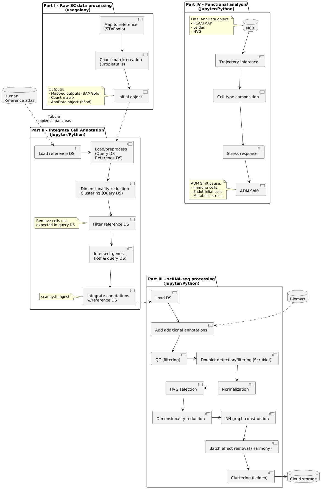

**Figure 1: Complete Processing flow**

## Part I - Preprocessing

Part I included preprocessing of scRNA-seq reads and matrix creation (Galaxy WF).  Following steps were performed in the galaxy environment (usegalaxy.eu):  
 (1) Mapping (RNAstar solo)  
 (2) Utility for handling of SC input data (DropletUtils)  
 (3) AD object creation.  

## Part II - Integration of annotation and metadata 

Part II of the processing included preprocessing of reference dataset [2] and its use for annotation of query dataset using scanpy ingest. It was performed on Google colab environment (Jupyter notebook w/python core - code can be made available on request).  Following steps were performed:  
 (1) Load and preprocess the reference dataset  
 (2) Import query dataset from google drive  
 (3) Update gene annotation for query dataset  
 (4) Preprocess query dataset  
 (5) Dimensionality reduction and clustering (query dataset)  
 (6) Remove cells not expected in query dataset from reference dataset  
 (7) Intersect genes between two datasets  
 (8) Map onto a reference dataset using ingest.  

## Part III - single cell object Processing pipeline

Part III of the processing included downstream processing pipeline for SC (scanpy standard flow). It was performed on Google colab environment (Jupyter notebook w/python core - code can be made available on request).  Following steps were performed:  
 (1) Load AD object from Galaxy  
 (2) Filter out reads containing genes that are not of interest (Mitochondrial, ribosomal, hemoglobin genes, pseudogenes etc.)  
 (3) Filter cells based on quality  
 (4) Doublet detection  
 (5) Normalization  
 (6) Feature selection  
 (7) Dimensionality reduction  
 (8) Nearest neighbor graph constuction and visualization (UMAP)  
 (9) Clustering with Leiden comunity  
 (10) Quality control and cell filtering - reassessment  
 (11) Cluster annotation  
 (12) Create markers for known Pancreatic cell types  
 (13) Create dotplots to identify markers per cluster  
 (14) Plot top cluster marker genes  
 (15) Differentially expressed genes  
 (16) Automatic cell type annotation (celltypist)  
 (17) Trajectory inference.  

## Part IV - Functional analysis

Part IV of the processing included downstream Functional analysis of the obtained (**) results.  Following analysis was performed:  
 (1) Conversion of the source .rds file into h5ad format (sceasy convert - usegalaxy.eu)  
 (2) Inspection, clean up and QC of the final adata object  
 (3) Single cell object processing w/scanpy  
 (4) Predict labels for query dataset  
 (5) HVG feature selection, scaling and dimensionality reduction  
 (6) Nearest neighbor graph construction  
 (7) Batch detection (see Figure 2) and removal (see Figure 3)  
 (8) Functional analysis - see following section.  

# Biological Interpretation of the Results 

Final part of the analysis was interpreting obtained results in the light of metabolic stress conditions to which the cells were exposed. 

## Cell identities

After processing steps (see Part IV, steps (1) - (6), plotting clusters of cell families in the data matrix revealed batch effect (see Figure 2).

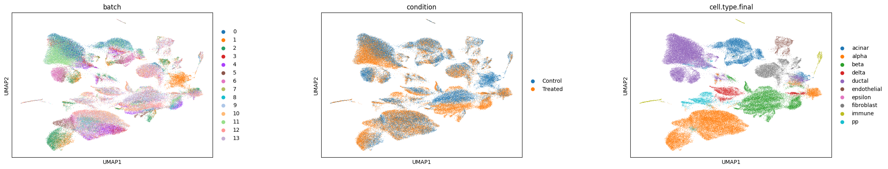

**Figure 2: UMAP plots (batch, treatment, cell.type.final) - batch effect** 

After batch removal (using Harmony, Part IV, step (7)), the batch effect was not detected any more, see Figure 3.

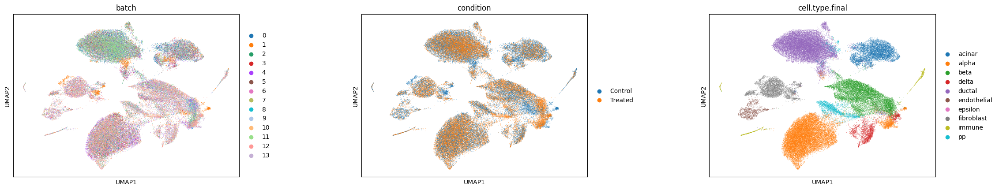

**Figure 3: UMAP plots - batch effect removed**

**Comment**

Comparing middle plot for Acinar, Ductal and Alpha cells clusters shows complete overlapping of treated and control conditions.   This confirms that these cell types are relatively stable in their overall transcriptomic identity (resilience).
Beta cells cluster on the other hand shows some separation between Control and Treated conditions, which denotes change of transcriptomic identity.

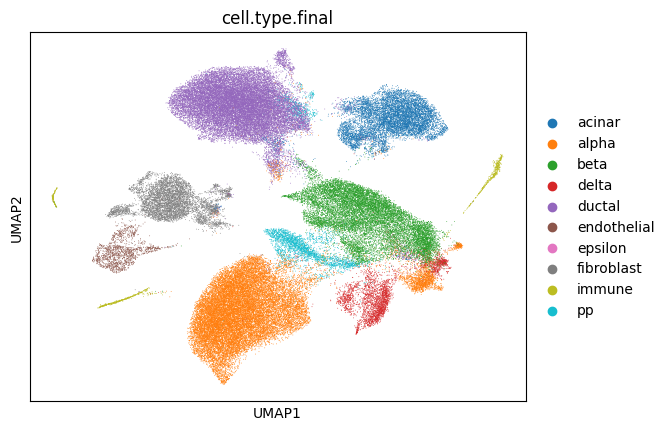

**Figure 4: UMAP plot of cell families**

**Comment**

The UMAP plot of cell families shows also rare epsilon cells, which are closely related to alpha cells.  Separate plot is required to highlight their position in the UMAP plot to reveal the proximity to the alpha cells cluster.

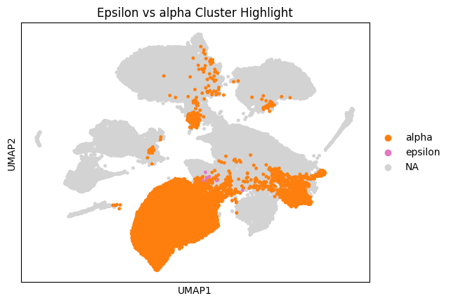

**Figure 5: UMAP plot w/highlighted alpha/epsilon cell clusters**

**Comment**

The UMAP plot reveals that they are indeed near the alpha cluster, but they maintain their transcriptomic identity.  Another important plot is the UMAP plot of Ghrelin they secrete.

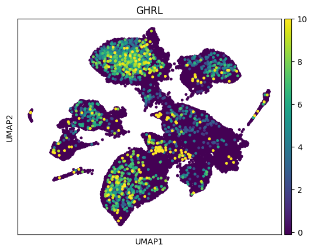

**Figure 6: UMAP plot of Ghrelin**

**Comment**

The UMAP plot reveals that secretion of Ghrelin is most intense in the vicinity of epsilon cell cluster.

## Metabolic stress

Figure 7 shows response to metabolic stress of cells under test in a dotplot. Following markers were used 
 GCG -> most significant product of alpha cells 
 INS -> most significant product of beta cells  
 EHMT1, EHMT2 -> Epigenetic modulators driving the remodeling of gene regulatory network under stress  
 GHRL -> most significant product of epsilon cells. 
 
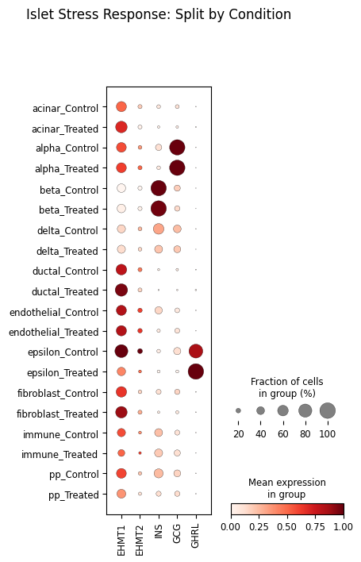

**Figure 7: Metabolic stress response of pancreatic islets**

This plot provided some detail, but in order to get a more detailed picture, I created separate plot of endocrine and exocrine cell families. 

### Endocrine cell response to metabolic stress

In order to make more distinction in the endocrine department, I created separate plots for Alpha cells (Figure 8) and Beta cells (Figure 9).

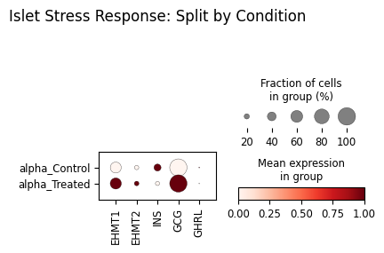

**Figure 8: Alpha cell response**

**Comment**
 
(1) GCG (Glucagon) response 
Treated population -> GCG dot remains remarkably large and dark. This confirms that unlike beta cells, alpha cells do not lose their primary hormonal identity under metabolic stress. 
 
*Conclusion* 
Alpha cell response show resilience to metabolic stress
 
(2) EHMT1/2 Upregulation 
Just like  beta cells,  alpha cells also show a dramatic increase in EHMT1 and EHMT2 expression. This proves that the epigenetic "stress response" is happening across all endocrine cells, but the outcome is different: it disables beta cells while alpha cells stay stable.

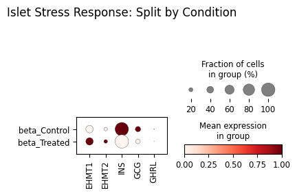

**Figure 9: Beta cell response**

**Comment**
 
(1) INS (Insulin) response 
Control population -> shows as a healthy state where almost 100% of beta cells are pumping out high levels of Insulin 
Treated population -> fewer cells expressing INS, the average expression per cell has dropped.  

*Conclusion* 
This shows direct evidence of beta cell dysfunction.
 
(2) Regulatory Flip -> Epigenetic regulators (EHMT1 and EHMT2), almost undetectable under normal conditions, exhibit significant increase in treated cell population.  
 
*Conclusion*  
Metabolic stress triggers epigenetic regulators (G9a and GLP), which then act as brakes on the islet's functional genes like Insulin.

### Exocrine cell response to metabolic stress

I have examined response of exocrine cells (acinar - Figure 10, ductal - Figure 11, and delta cells - Figure 12) to metabolic stress. 

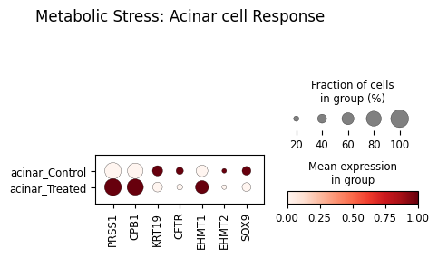

**Figure 10: Exocrine cell response - Acinar cells**

**Comment**
(1) Metabolic shock 
Under treatment condition, secretion of digestive proteases PRSS1 and CPB1 increases significantly. In the control, these dots are faint/pale. 
This is a sign of massive metabolic shock — the cells are reacting by over-producing, potentially leading to self-digestion. 
 
(2) Epigenetic upregulation 
Production of EHMT1 goes up with the enzymes, which indicates shift in epigenetic activity as a consequence of metabolic shock. 
 
(3) Metaplasia (ADM)  
In a state of metabolic shock, acinar cell are expected to change their identity to ductal, but the dotplot reveals that SOX9 (ductal marker) actually decreases.  
This refutes the standard "Identity Shift" (Metaplasia) theory for this specific data. 

Conclusion -> Acinar cells are failing, but they are not successfully transforming.

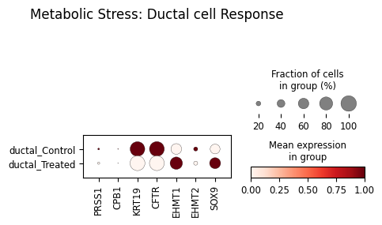

**Figure 11: Exocrine cell response - Ductal cells**

**Comment**
(1) Identity loss 
KRT19 and CFTR (ductal markers) and SOX9 (ductal identity and progenitor status) are reduced, which indicates, that Ductal cells appear to be losing functionally and identities.   
 
Epigenetic upregulation 
Similar to Acinar cell, production of EHMT1 goes up with the enzymes, which indicates shift in epigenetic activity as a consequence of metabolic shock.   
 
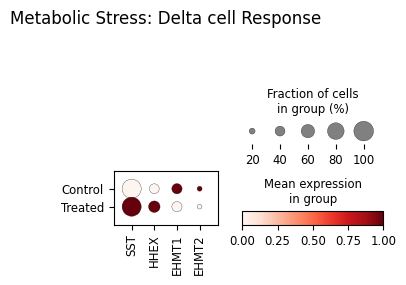

**Figure 12: Exocrine cell response - Delta cells**  

**Comment**
(1) Epigenetic downregulation 
Since EHMT1 is not regulated in the same way in all affected cells, it can not be directly related to metabolic stress   
 
Somatostatin (SST) 
SST expression increases (becomes darker/larger) in the Treated group, HHEX (the Delta cell master regulator) also increases. In a typical diabetic model, Delta cells are expected to fail. 
By ramping up  SST, these cells are likely trying to shut down the Alpha and Beta cells to protect them from the metabolic stress (hyper-secretion exhaustion). 
 

# Final conclussion
 
The high concentration to which the cells were exposed shows that they are overstressed and probably dying of lipo-gluco toxicity. 
This show that limitation of the model that was used for this study -> transcriptomic signature of acute metabolic poisoning, not necessarily the signature of chronic Type 2 Diabetes

References:  
 [1] Single-cell RNA Sequencing Uncovers Molecular Mechanisms of Human Pancreatic Islet Dysfunction Under Overnutrition Metabolic Stress (human)  
 [2] Tabula sapiens - pancreas.h5ad  

Notes:  
 (*) First three parts of the analysis were performed using a subset of full data available on the NCBI.  
 (**) Part IV - the Functional analysis was performed on the raw data set provided by the authors of the study (section Supplementary file). The .rds file was first converted to h5ad file format in the Galaxy platform and then imported into pyhton environment. Functional analysis was performed using this file, not the file obtained in the Parts I-III 
